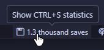

# Ctrl + S

The extension that keeps track of how many times you press ctrl + s (save a file), to really make sure you saved that file.



## Statistics Dashboard

Generate a detailed, terminal-style breakdown of your saving habits by running the **Show CTRL + S Statistics** command or clicking the statusbar:

```text
##
# CTRL + S Statistics
##

Total Saves    : 40,053
Daily Average  : ~328 saves/day
Tracking Since : Saturday the 6th of December 2025

##
# Top 5 Languages
##

        go | ######################################## | 18,701
       lua | ##########################               | 12,383
javascript | #########                                | 4,311
       css | ##                                       | 830
      html | #                                        | 538

##
# Last 7 Days Activity
##

Wed 01 | #############                            | 271
Thu 02 | #######                                  | 154
Fri 03 | ######################################## | 863
Sat 04 | #############                            | 282
Sun 05 | ##########                               | 226
Mon 06 | ###############                          | 317
Tue 07 |                                          | 10

##
# 24-Hour Activity (All Time)
##

12 AM | ###############################          | 3,529
01 AM | #################                        | 1,966
02 AM | ###########                              | 1,247
03 AM | ########                                 | 907
04 AM | #####                                    | 537
05 AM | ##                                       | 261
06 AM | #                                        | 88
07 AM |                                          | 0
08 AM |                                          | 0
09 AM |                                          | 0
10 AM |                                          | 0
11 AM |                                          | 0
12 PM |                                          | 20
01 PM | ##                                       | 214
02 PM | ##########                               | 1,152
03 PM | ###############                          | 1,649
04 PM | ##################                       | 2,067
05 PM | ############################             | 3,149
06 PM | ###############################          | 3,532
07 PM | ##################################       | 3,885
08 PM | ######################################## | 4,534
09 PM | #################################        | 3,746
10 PM | ###################################      | 3,999
11 PM | ################################         | 3,571
```

## Commands

- `CTRL-S: Show Statistics`: Opens the dashboard.
- `CTRL-S: Reset Statistics`: Clears your save history.